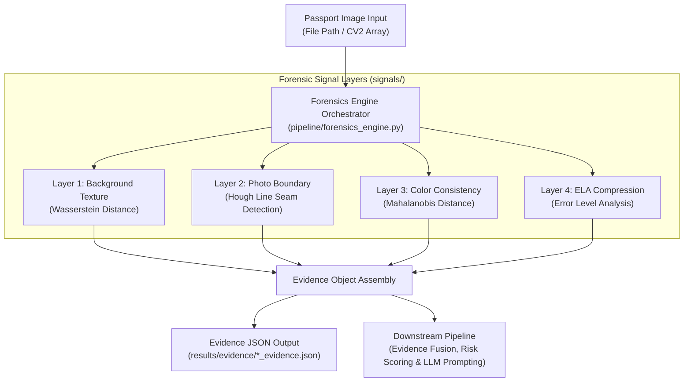

# Passport Document Forensic Layer

A modular, deterministic **Forensic Signal Processing Engine** for automated passport fraud detection. This subsystem executes multiple computer vision and image signal processing layers on passport documents to extract empirical physical/digital evidence of forgery, tempering, image splicing, or synthetic generation.

The output produced by this layer is a structured **Evidence Object** (JSON) designed for seamless downstream integration with **Evidence Fusion**, **Risk Scoring**, and **LLM Explanation** engines.

---

## 🏛️ System Architecture



---

## 🔬 Forensic Signal Layers

| Layer | Module | Method / Metric | Purpose |
|---|---|---|---|
| **Layer 1: Background Texture** | [`signals/background_texture.py`](signals/background_texture.py) | Patch extraction + 1D Wasserstein Distance | Verifies background guilloche pattern consistency against calibrated genuine reference histogram. |
| **Layer 2: Photo Boundary** | [`signals/photo_boundary.py`](signals/photo_boundary.py) | Photo bbox extraction + Hough Line Transform | Detects sharp, straight rectangular cut-out seams around the portrait indicating pasted/spliced photos. |
| **Layer 3: Color Consistency** | [`signals/color_consistency.py`](signals/color_consistency.py) | 6D LAB Color Signature + Mahalanobis Distance | Measures overall color profile distance ($D_M$) against genuine baseline population ($L, a, b$ mean & std). |
| **Layer 4: Error Level Analysis** | [`signals/ela.py`](signals/ela.py) | JPEG Re-compression Differential | Identifies re-compression anomalies indicating synthetic resaving, digital editing, or altered regions. |

---

## 📁 Repository Structure

```
forensic_layer/
├── dataset/
│   ├── reals/                    # Genuine passport samples for calibration/testing
│   └── fakes/                    # Forged/manipulated passport samples for evaluation
├── pipeline/
│   ├── __init__.py
│   └── forensics_engine.py       # Core orchestrator running all layers & building Evidence Object
├── signals/
│   ├── __init__.py
│   ├── background_texture.py     # Layer 1 implementation & calibration
│   ├── photo_boundary.py         # Layer 2 implementation & calibration
│   ├── color_consistency.py      # Layer 3 implementation & calibration
│   └── ela.py                    # Layer 4 implementation & calibration
├── results/
│   ├── embeddings/               # Extracted per-layer vector embeddings (JSON)
│   ├── evidence/                 # Unified Evidence Objects (JSON output)
│   ├── layer1_metadata.json      # Calibrated background texture thresholds
│   ├── layer2_metadata.json      # Calibrated photo boundary straightness thresholds
│   ├── layer3_color_baseline.json# Calibrated genuine LAB mean vector & covariance matrix
│   └── layer4_ela_metadata.json  # Calibrated genuine ELA error compression band
├── experiments/                  # Exploratory scripts & baseline verifications
└── README.md                     # System documentation
```

---

## 🚀 Quick Start & Usage

### Prerequisites

Ensure Python 3.9+ is installed along with the required dependencies:

```bash
pip install numpy opencv-python scipy matplotlib
```

### 1. Run Demo on Sample Images

Run all 4 layers on sample real and fake passport images from the `dataset/` directory:

```bash
python3 -m pipeline.forensics_engine
```

### 2. Run on a Single Image

To run forensic evaluation on a single passport image:

```bash
python3 -m pipeline.forensics_engine /path/to/passport.jpg
```

### 3. Run Batch Processing on a Directory

Process an entire directory of passport images at once:

```bash
python3 -m pipeline.forensics_engine --batch-dir /path/to/passport_folder/
```

### 4. Calibrate Individual Layers

Each layer can be run independently to re-calibrate thresholds against genuine document distributions:

```bash
# Calibrate Layer 1 (Background Texture)
python3 signals/background_texture.py

# Calibrate Layer 2 (Photo Boundary)
python3 signals/photo_boundary.py

# Calibrate Layer 3 (Color Consistency)
python3 signals/color_consistency.py

# Calibrate Layer 4 (Error Level Analysis)
python3 signals/ela.py
```

---

## 📊 Evidence Object Specification

Every evaluation produces a structured JSON output saved under `results/evidence/{document_id}_evidence.json`.

```json
{
  "document_id": "aze_passport_00_fake_3_104",
  "image_source": "/path/to/dataset/fakes/aze_passport_00_fake_3_104.jpg",
  "timestamp_utc": "2026-09-05T02:00:18.857369+00:00",
  "engine_version": "0.1.0",
  "layers_requested": 4,
  "layers_completed": 4,
  "layers_failed": 0,
  "all_passed": false,
  "findings": [
    {
      "layer_name": "Layer 1: Background Texture Analysis",
      "finding_type": "background_texture_anomaly",
      "score": 1.0,
      "confidence": 1.0,
      "severity": "high",
      "passed": false,
      "raw_metric": { "distance": 8.28e-05, "threshold": 4e-05, "verdict": "ANOMALOUS_TEXTURE" },
      "explanation": "Background texture Wasserstein distance (8.28e-05) exceeds calibrated genuine threshold (4e-05) — indicates non-matching security pattern."
    },
    {
      "layer_name": "Layer 2: Photo Boundary Analysis",
      "finding_type": "processing_error",
      "score": 1.0,
      "confidence": 0.0,
      "severity": "high",
      "passed": false,
      "raw_metric": { "long_straight_line_count": 0, "total_lines_detected": 0, "threshold": 7.5 },
      "explanation": "Could not locate photo region for boundary analysis."
    },
    {
      "layer_name": "Layer 3: Color Consistency Analysis",
      "finding_type": "color_consistency_anomaly",
      "score": 1.0,
      "confidence": 1.0,
      "severity": "high",
      "passed": false,
      "raw_metric": {
        "mahalanobis_distance": 50.2637,
        "threshold": 3.2748,
        "color_signature": [213.6522, 120.197, 133.375, 47.8916, 6.3208, 6.6273]
      },
      "explanation": "Color signature Mahalanobis distance is 50.26 (threshold 3.27) — deviates significantly from genuine baseline."
    },
    {
      "layer_name": "Layer 4: Error Level Analysis (ELA)",
      "finding_type": "compression_artifact_anomaly",
      "score": 1.0,
      "confidence": 1.0,
      "severity": "high",
      "passed": false,
      "raw_metric": {
        "mean_error": 0.6632,
        "std_error": 0.9013,
        "max_error": 15,
        "p95_error": 2.0,
        "high_error_pct": 0.0055,
        "threshold_min": 1.311,
        "threshold_max": 1.4218
      },
      "explanation": "Error Level Analysis error (0.663) is unnaturally low compared to genuine baseline ([1.31 - 1.42]) — indicates digital resaving/synthetic generation."
    }
  ],
  "flagged_findings": [ /* Contains array of failed findings only */ ],
  "anomaly_summary": [
    {
      "layer": "Layer 3: Color Consistency Analysis",
      "severity": "high",
      "score": 1.0,
      "confidence": 1.0,
      "explanation": "Color signature Mahalanobis distance is 50.26 (threshold 3.27) — deviates significantly from genuine baseline.",
      "raw_metric": { ... }
    }
  ],
  "errors": [],
  "elapsed_seconds": 0.094
}
```

---

## 🤝 Downstream Integration Contract

This subsystem delivers the **Evidence Object**. It intentionally excludes:
* ❌ Risk Fusion & Weighted Scoring
* ❌ Rule-Based Risk Decisioning
* ❌ Natural Language / LLM Explanation Generation

Downstream services consume `evidence["anomaly_summary"]` or `evidence["flagged_findings"]` directly to perform evidence fusion, compute final risk scores, and prompt an LLM for natural-language audit reports.